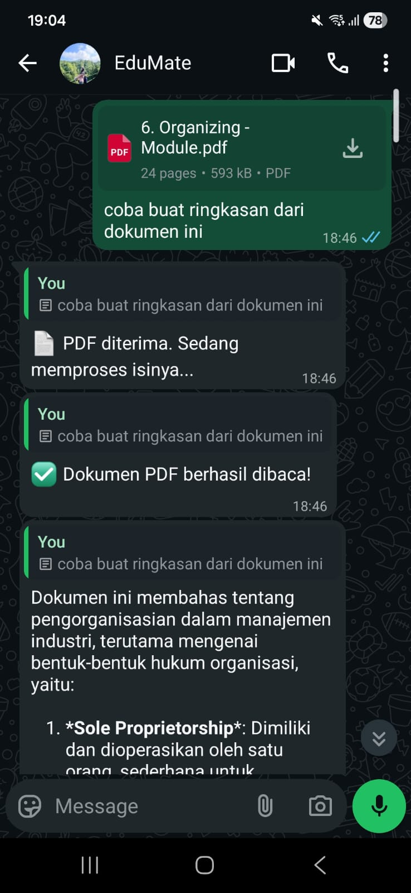
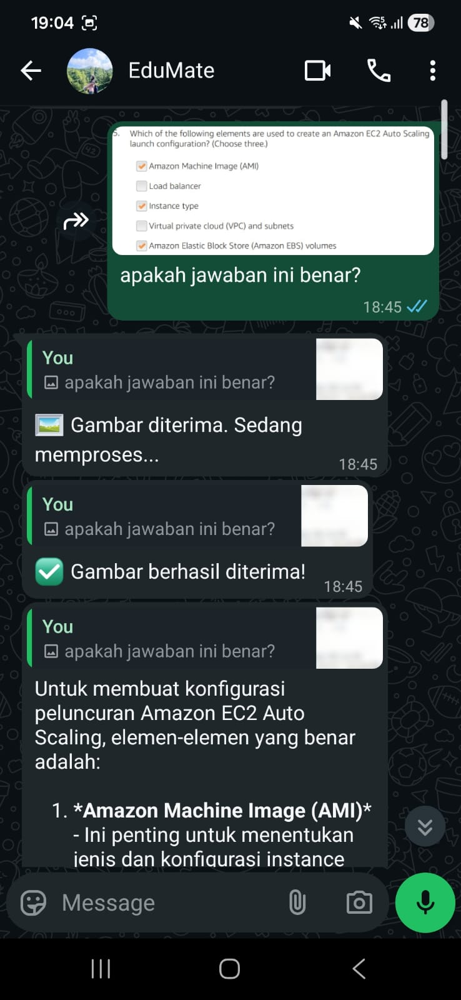
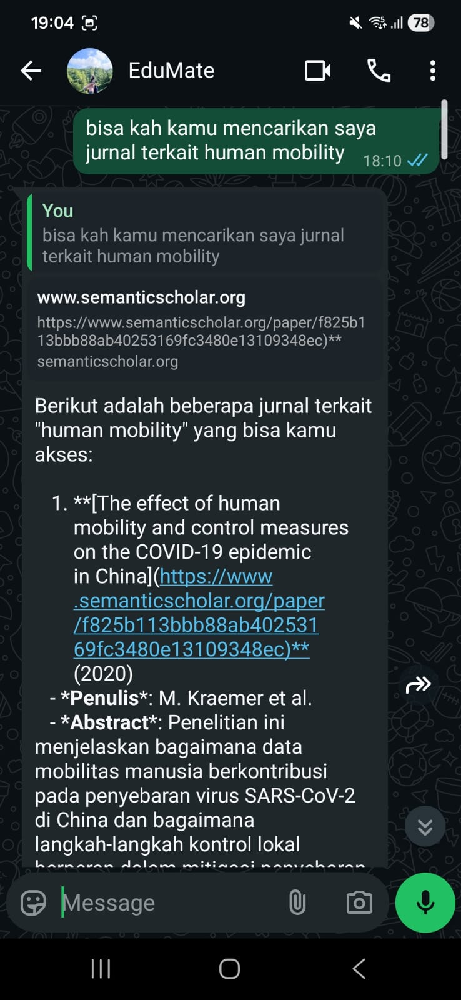

# EduMate-Agent 

**EduMate** adalah sebuah Agent yang berfungsi sebagai asisten belajar virtual untuk mahasiswa. Agent ini terintegrasi dengan WhatsApp, memungkinkannya untuk diakses dengan mudah kapan saja dan di mana saja.

---

## ✨ Fitur Utama

* **Memori Persisten:** Menggunakan **MongoDB** untuk menyimpan riwayat percakapan. Agent ini mampu mengingat konteks dari obrolan sebelumnya.

* **Pemrosesan PDF (RAG):** Pengguna dapat mengunggah file PDF. Agent akan mem-parsing teksnya dan menggunakan konten tersebut sebagai konteks untuk menjawab pertanyaan berikutnya.

* **Manajemen Sesi:** Agent mengerti perintah khusus seperti `/reset` untuk menghapus memori percakapan dan sesi PDF saat ini.

* **Arsitektur Tervalidasi:** Kualitas kode dipastikan melalui **7 unit test** (`jest`) yang mencakup logika *database* dan *core agent*.

---

## 🚀 Demo

Berikut adalah contoh alur penggunaan bot, mulai dari proses login hingga percakapan.

1.  **Proses Login dengan Scan QR Code**  
    Setelah bot dijalankan, sebuah kode QR akan muncul di terminal. Scan menggunakan aplikasi WhatsApp di HP untuk menghubungkan bot.  
    <br>

2.  **Contoh Alur Percakapan**  
    Contoh percakapan yang menunjukkan respons dari file berupa PDF, gambar, pencarian jurnal, serta *long-term memory*.  
    <br>[🎥 Video Demo](https://youtu.be/2VqG8moouBE)

    | PDF | Gambar | Pencarian Jurnal | *Long Term Memory* | 
    | :---: | :---: | :---: | :---: |
    |  |  |  |  |

---

## 🛠️ Setup & Instalasi

Berikut adalah langkah-langkah untuk menjalankan bot ini di komputermu.

### **Prasyarat**

* **Node.js**: Pastikan kamu sudah menginstal Node.js (disarankan versi `18.x` atau lebih baru).
* **Nomor WhatsApp**: Siapkan satu nomor WhatsApp yang akan digunakan untuk bot.
* **MongoDB**: Siapkan database MongoDB untuk menyimpan riwayat percakapan.
* **OpenAI API Key**: API Key untuk memanggil LLM model OpenAI.

---

### **Langkah-langkah Instalasi**

1.  **Clone Repositori**
    ```bash
    git clone https://github.com/nashatr4/EduMate-Agent
    cd EduMate-Agent
    ```

2.  **Install Dependencies**
    ```bash
    npm install
    ```

3.  **Konfigurasi Environment**
    Pastikan file `.gitignore` sudah berisi baris berikut agar file rahasia tidak ikut terupload:
    ```bash
    # .gitignore
    node_modules/
    .env

    *.log
    .wwebjs_auth
    .wwebjs_cache
    ```

---

## ▶️ Menjalankan Bot

1.  **Jalankan Perintah Start**
    ```bash
    npm start
    ```

2.  **Scan QR Code**
    Setelah perintah dijalankan, sebuah QR Code akan muncul di terminalmu.  
    Buka WhatsApp di HP → **Setelan** → **Perangkat Tertaut** → **Tautkan Perangkat**, lalu scan kode tersebut.

3.  **LLM Agent Siap Digunakan!**
    Setelah berhasil, terminal akan menampilkan pesan  
    `"✅ Bot WhatsApp siap digunakan!"`  
    Kamu bisa mulai mengirim pesan ke nomor bot dari nomor WhatsApp lain.

---

## 🧪 Menjalankan Tes

Proyek ini dilengkapi dengan unit test menggunakan **Jest** untuk memastikan bot berjalan dengan benar.

Untuk menjalankan semua tes:
```bash
npm test
